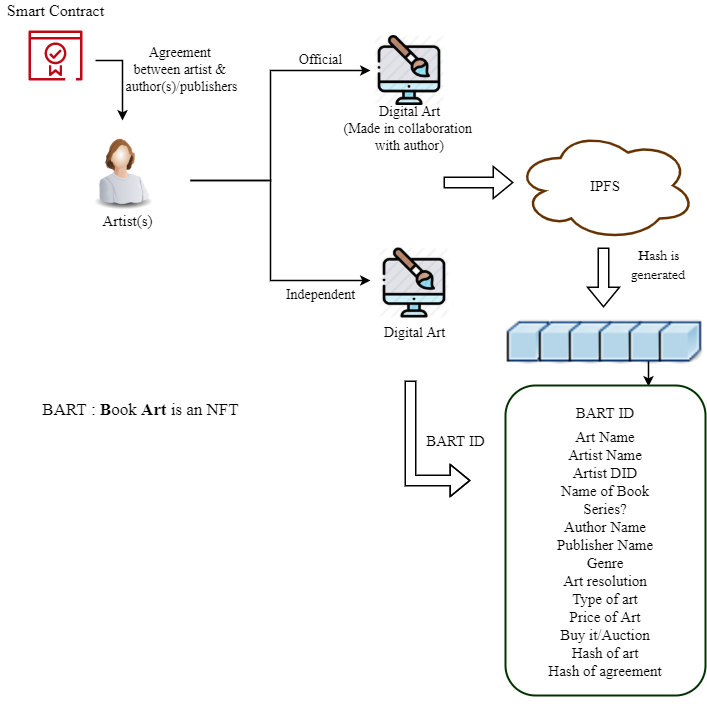

# NFT-Platform-for-Books
    

## Introduction

#### Book Cover and Limited Edition
  

  
  
  

  
#### Figurines
  

  
  
  
  

  
## Abstract 

## Proposed Architecture 

## Usecases 
  - <b>Author</b>
  
  

  
  

  
  - <b>Publisher</b>
  
  

  
  

  
  - <b>Independent Artist</b>
  
  

  
  

  
  - <b>Figurine Artist</b>
  
  

  
  

 
## Demo
[Click here]() to access the webpage.

## Acknowledgement
We would like to acknowldge the support provided by TIFAC-CORE in Cyber Security, Amrita School of Engineering, Amrita Vishwa Vidyapeetham, Coimbatore, India in carrying out this work as part of "20CY712 - Blockchain Technology" Course. 

## References

 - Ramaguru R, Minu M. Blockchain Terminologies. NamChain Open Initiative Research Lab (2021). https://github.com/NamChain-Open-Initiative-Research-Lab/Blockchain-Terminologies

## Publication
TBD

